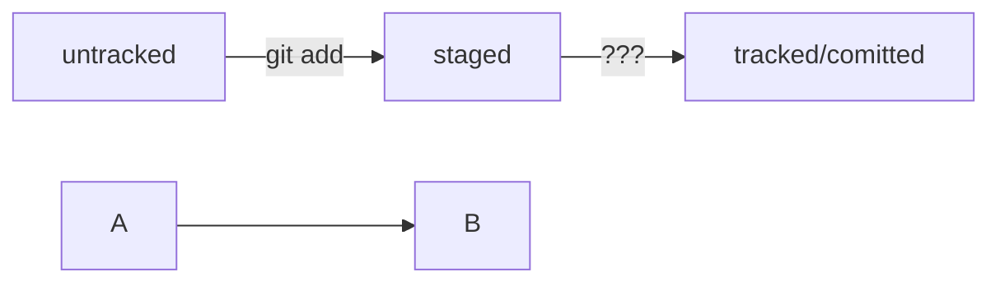

# Начало работы с git-репозиторием
* Создать директорию проекта командой **mkdir**
* Инициализировать git-репозиторий командой **git init**
* Добавить файлы, используя команду **touch**
* Перед коммитом изменений необходимо их *запомнить* командой **git add**

## После создания удалённого репозитория, генерации SSH-ключа и привязывания его к GitHub(один раз)

- Привязать удалённый репозиторий к локальному командой **git remote add origin** *git@github.com:%ИМЯ_АККАУНТА%/first-project.git*
- Синхронизировать удалённый и локальный репозитории командой **git push -u origin main**
- Отправить изменения на удалённый репозиторий командой **git push**

# Хэш

# Статусы и жизненный цикл файлов в Git

#  mermaid-схема
